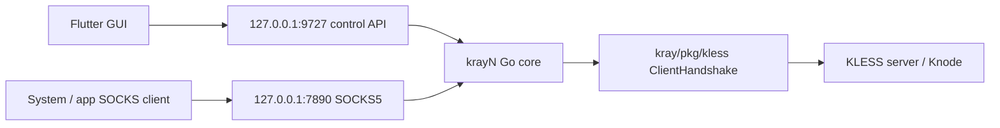

# krayN Architecture

krayN uses `kexue-aihao/kray` as the protocol core and keeps the GUI separate from the hot path.

## Layers

- `third_party/kray`: pinned upstream KLESS v1 core as a Git submodule.
- `core`: Go runtime process. It owns KLESS handshakes, local SOCKS5, outbound transport dialing, profile storage, telemetry counters, and the local HTTP control API.
- `app`: Flutter GUI. It manages nodes, starts and stops the core, displays traffic state, and edits profiles through the control API.
- `scripts`: build helpers for the core and Flutter app.

## Runtime Flow

The SOCKS5 path writes a small connect request over the encrypted KLESS stream. A compatible server-side relay should call `kless.ServerHandshake`, read `proxy.ReadConnectRequest`, connect to the requested target, send `proxy.WriteConnectResponse`, and relay bytes.

## Platform Shape

The desktop app runs the Go core as a sidecar binary. Android and iOS should replace that sidecar with native bindings or a platform service:

- Android: `VpnService` plus either a native Go shared library or a foreground service running the core.
- iOS / iPadOS: Network Extension packet tunnel provider plus a compiled core library.
- Windows / macOS / Linux: desktop Flutter bundle plus matching `krayn-core` executable.

System-level TUN/VPN capture is intentionally outside the first Go SOCKS runtime. The control API and profile model are stable enough for that native layer to reuse.

